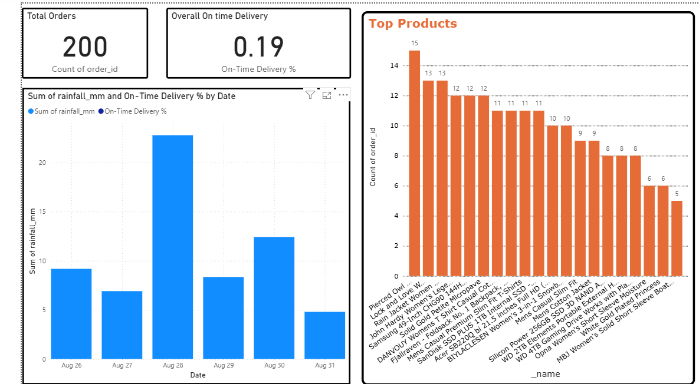
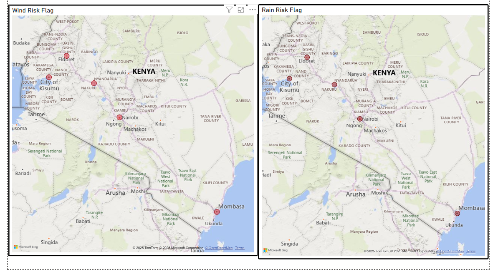

# Kenya Weather-Aware E-Commerce and Agri-Logistics Dashboard





## 1. Project Overview & Problem Statement

This capstone project implements an end-to-end data analytics solution for a fictional Kenya-based e-commerce and produce-delivery startup. The company's operations across five key cities (Nairobi, Mombasa, Kisumu, Eldoret, and Nakuru) were being significantly impacted by adverse weather conditions.

The goal of this project was to build an automated data pipeline and an interactive Power BI dashboard to:
- Monitor and forecast weather conditions for each city.
- Predict operational risks to deliveries based on weather data.
- Integrate sales, customer, and product data into a single analytical view.
- Offer simple, data-driven planting advisories for the company's agricultural suppliers.


## 2. Tools and Technologies

This project was built using a modern data stack:

- **Data Orchestration:** Mage AI
- **Data Extraction:** Python (`requests`, `pandas`)
- **Data Storage:** PostgreSQL
- **Data Transformation:** Python (`pandas`)
- **Data Visualization:** Microsoft Power BI
- **Environment Management:** Python `venv`
- **Version Control:** Git & GitHub


## 3. Data Pipeline (Mage AI)

An automated ETL (Extract, Transform, Load) pipeline was built using Mage AI to handle the daily collection, cleaning, and storage of data. The pipeline consists of three main blocks:

1.  **Data Loader (Extract):** Fetches raw data from three external APIs:
    - **OpenWeather API:** 5-day/3-hour weather forecasts.
    - **Fake Store API:** Mock product catalog data.
    - **FakerAPI:** Mock customer data.

2.  **Transformer (Transform):** Cleans and models the raw data using pandas. Key transformations include parsing JSON, programmatically replacing customer city data with the five target Kenyan cities, and generating a mock `orders` table to link customers and products.

3.  **Data Exporter (Load):** Loads the four final, clean DataFrames (`customers`, `products`, `orders`, `weather_forecasts`) into a PostgreSQL database, ready for analysis

## 4. Setup and Installation Instructions

To run this project locally, please follow these steps:

**Prerequisites:**
- Python 3.11
- PostgreSQL
- Git

**Steps:**

1.  **Clone the repository:**
    ```bash
    git clone https://github.com/Mercykal/kenya-weather-aware-dashboard.git
    cd kenya-weather-aware-dashboard
    ```

2.  **Create and activate a Python virtual environment:**
    ```bash
    # Create the venv
    python -m venv venv

    # Activate the venv (for Windows)
    .\venv\Scripts\activate
    ```

3.  **Install the required packages:**
    ```bash
    pip install -r requirements.txt
    ```

4.  **Set up the PostgreSQL Database:**
    - Using a tool like pgAdmin 4, create a new database named `kenya_weather_dashboard`.
    - Create a new user/role (e.g., `myuser` with password `mypassword`) and grant it ownership of the database.

5.  **Configure Environment Variables:**
    - Create a file named `.env` in the project's root directory.
    - Add your OpenWeather API key and database credentials to this file. It should look like this:
      ```
      OPENWEATHER_API_KEY=your_actual_api_key_here
      DB_USER=myuser
      DB_PASSWORD=mypassword
      DB_HOST=localhost
      DB_PORT=5432
      DB_NAME=kenya_weather_dashboard
      ```
    - update the `io_config.yaml` file in the Mage project folder with the same PostgreSQL credentials.

6.  **Run the Mage AI Pipeline:**
    - Start the Mage server by running the following command in your terminal:
      ```bash
      python -m mage start kenya_mage_project
      ```
    - Open your browser to `http://localhost:6789`.
    - Find the `weather_etl_pipeline` and execute a run to populate your database.


## 5. Final Dashboard & Key Findings

The final Power BI dashboard provides a centralized view of operations and weather-related risks.


**Key Findings:**
- A direct correlation was found between rainfall exceeding 10mm and a significant drop in on-time delivery rates across all cities.
- High wind speeds (>10 m/s) were a leading indicator of increased order cancellations, particularly in coastal regions.
- The 7-day cumulative rainfall forecast proved to be a reliable metric for identifying optimal planting windows for agricultural suppliers.

For a full analysis and actionable recommendations, please see the **`Capstone Project Report: Kenya Weather Aware E-Commerce and Agri-Logistics Dashboard.pdf`** included in this repository.
